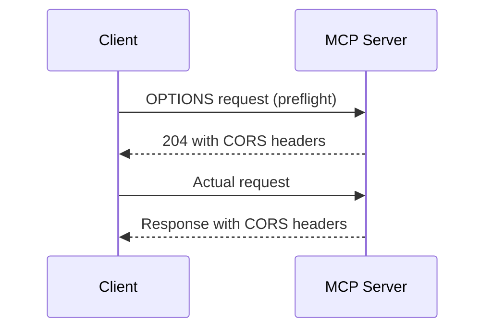

# CORS

👨‍💼 In our MCP server's case, users will always be accessing us from either a different domain or a desktop application. This means every single request is cross-origin by nature, making CORS headers absolutely essential for our server to function at all.

If we can't handle cross-origin requests properly, users will encounter frustrating errors and won't be able to access the server's capabilities from their preferred applications or domains. The problem is: how do we enable secure cross-origin communication while maintaining the security standards that protect our users and server?

```ts
// Example: A user trying to access our MCP server from a different domain
const response = await fetch('https://our-mcp-server.example.com/mcp', {
	method: 'POST',
	headers: {
		'Content-Type': 'application/json',
		'mcp-protocol-version': '2024-11-05',
	},
	body: JSON.stringify({
		jsonrpc: '2.0',
		id: 1,
		method: 'tools/list',
	}),
})
```

Without proper CORS headers, this request would fail with a "CORS policy" error, leaving users unable to connect to our server from their applications. This breaks the fundamental promise of MCP - seamless integration across different tools and platforms.

Whether users are connecting from a web application on a different domain or from a desktop application like VS Code, CORS headers are the gateway that allows these cross-origin requests to succeed.

To solve this, we need to implement CORS support that allows legitimate cross-origin requests while maintaining security. The key is to add the right headers to our responses, especially for the `/.well-known` endpoint which needs to be publicly accessible.

<callout-warning class="important">
	CORS is not just about adding headers - it's about enabling secure
	cross-origin communication while protecting against malicious requests. The
	`/.well-known` endpoint is particularly important as it's used for service
	discovery.
</callout-warning>

<callout-info>
	🚀 The `withCors` utility function will handle the complexity of CORS headers,
	preflight requests, and response modification, so you can focus on the
	business logic.
</callout-info>



<callout-muted>
	📜 For more details on CORS and how it works, see the [MDN documentation on
	CORS](https://developer.mozilla.org/en-US/docs/Web/HTTP/CORS).
</callout-muted>

The goal is to make our MCP server accessible from any legitimate client while maintaining the security and reliability that users expect. Users should be able to discover and connect to our server without worrying about origin restrictions.

🧝‍♀️ By the way, I've prepared a `withCors` utility function in <InlineFile file="src/utils.ts" /> that will handle all the CORS complexity for you. You just need to wrap your existing handler with it and configure the appropriate headers for the `/.well-known` endpoint.

Here's a simple example of how to use it:

```ts
// Before: Basic handler
export default {
	fetch: async (request, env, ctx) => {
		// Your existing logic here
		return new Response('Hello World')
	},
}

// After: Wrapped with CORS support
export default {
	fetch: withCors({
		getCorsHeaders: (request) => {
			// Return CORS headers based on the request
			// 💰 check the request.url property
			// Return null/undefined for no CORS headers
		},
		handler: async (request, env, ctx) => {
			// Your existing logic here
			return new Response('Hello World')
		},
	}),
}
```

👨‍💼 Thanks Kellie! Let's take a look at that.

Now, start by understanding why CORS matters for MCP servers, implement the solution using the provided utility, and test that cross-origin requests work properly.
