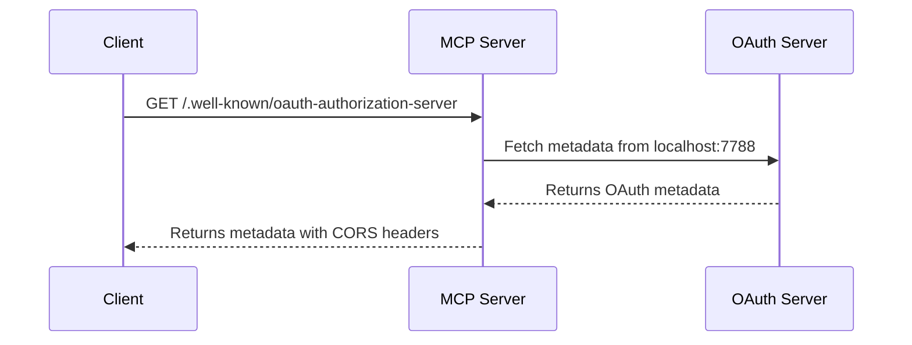

# Auth Server Metadata

👨‍💼 Now that clients can connect to our MCP server from any domain, they need to be able to discover how to authenticate with our system. When clients want to access protected resources or perform actions that require authentication, they need to know where to go and what methods are available.

The problem is: how do we provide clients with the information they need to authenticate with our OAuth server? Without this metadata, clients will be stuck because they can't figure out authentication endpoints and supported features.

```ts
// Example: A user trying to discover our OAuth server capabilities
const response = await fetch(
	'https://our-mcp-server.example.com/.well-known/oauth-authorization-server',
)
const metadata = await response.json()
// metadata includes things like:
// - registration_endpoint - how to register a new client for dynamic client registration
// - authorization_endpoint - where to send users to confirm the connection
// - token_endpoint - where to request a token once they have a auth code
// plus more things necessary for the client to set up the connection for the user
```

<callout-info class="aside">
	You can see what our Authorization Server metadata looks like by visiting
	[`http://localhost:7788/.well-known/oauth-authorization-server`](http://localhost:7788/.well-known/oauth-authorization-server).
</callout-info>

This metadata endpoint is the gateway that tells clients everything they need to know about our authentication system.

To do this, we need to implement the `/.well-known/oauth-authorization-server` endpoint that returns the OAuth server's metadata. This endpoint will fetch the metadata from our actual OAuth server and relay it to users, making our MCP server a complete authentication discovery hub.

<callout-warning class="important">
	The OAuth metadata endpoint is a standard that clients expect to find. Without
	it, clients won't be able to properly integrate authentication into their
	applications.
</callout-warning>

<callout-info>
	🔍 Doing this from our resource server is useful because some clients do not
	distinguish between the resource server and the auth server and will treat our
	resource server as the auth server. So we simply proxy to the auth server to
	get the metadata.
</callout-info>



<callout-muted>
	📜 For more details on OAuth authorization server metadata, see the [RFC 8414
	specification](https://tools.ietf.org/html/rfc8414).
</callout-muted>

The goal is to make authentication discovery seamless and standards-compliant, so users can easily integrate our OAuth system into their applications without any guesswork.

🧝‍♀️ By the way, I've set up the OAuth server to run on localhost:7788, and you'll need to create a new `auth.ts` file to handle the metadata request. The endpoint should fetch from `http://localhost:7788/.well-known/oauth-authorization-server` and return the response.

👨‍💼 Thanks Kellie!

Now, please implement the metadata endpoint.
