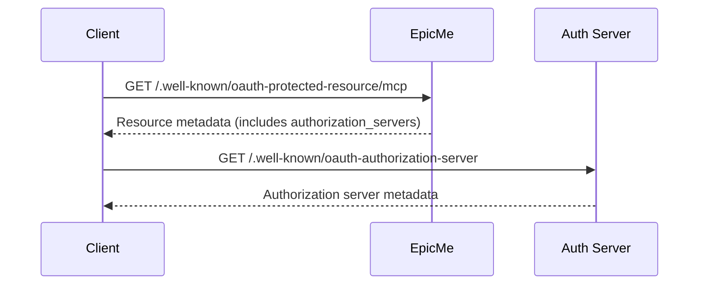

# Protected Resource

<EpicVideo url="https://www.epicai.pro/workshops/day-7-8-mcp-auth/protected-resource-8kue7" />

👨‍💼 For our journaling app it's crucial that clients can discover how to interact with our resource server in a standards-compliant way. The Model Context Protocol (MCP) and OAuth require that we expose a public metadata endpoint so that any client can learn how to authenticate and what endpoints are available. This endpoint must be accessible to everyone, without requiring authentication, because it's the first step in the OAuth discovery process.

But not all protected resources are the same! In a large system, you might have multiple APIs or services, each with its own protected data—think: user profiles, journal entries, or analytics. Each of these can be considered a separate "protected resource" in OAuth terms. To support this, the OAuth and MCP specifications allow for multiple resource metadata endpoints, each describing a different protected resource.

That's why, for EpicMe, our endpoint is:

```
/.well-known/oauth-protected-resource/mcp
```

The `/mcp` at the end uniquely identifies our journaling MCP endpoint as a specific protected resource. This makes it possible for clients to discover metadata for just the resource they want to access, even if the server hosts several different APIs. It also helps with future extensibility—if we add more protected resources later, each can have its own metadata endpoint under `/.well-known/oauth-protected-resource/`.

Here's how a client might discover resource server's metadata:

```ts
// Example: Discovering the MCP resource server's metadata
const response = await fetch(
	'https://api.example.com/.well-known/oauth-protected-resource/mcp',
)
if (response.ok) {
	const metadata = await response.json()
	// metadata.authorization_servers tells the client where to go next
} else {
	throw new Error('Could not discover resource server metadata.')
}
```

Here's an example of what the metadata content looks like:

```json
{
	"resource": "https://api.example.com/mcp",
	"authorization_servers": ["https://auth.example.com"]
}
```

There are [a some other fields you can supply](https://datatracker.ietf.org/doc/html/rfc9728#section-3.1), but these are the two most important for our purposes.

Here's the overall flow for a client discovering the resource server and then the authorization server:



<callout-info>
	🚦 The `/.well-known/oauth-protected-resource/mcp` endpoint must be accessible
	to all clients, without authentication. This is required by the OAuth and MCP
	specifications.
</callout-info>

<callout-muted>
	📜 For more details, see the [OAuth 2.0 Protected Resource Metadata
	RFC](https://datatracker.ietf.org/doc/html/rfc9728).
</callout-muted>

The goal is to make EpicMe's resource server discoverable and easy to integrate with any standards-compliant client. Make sure your implementation exposes the correct metadata endpoint for the MCP resource, so clients can start the OAuth flow without any roadblocks.

Now, check that your `/.well-known/oauth-protected-resource/mcp` endpoint is public, returns the correct metadata, and helps clients discover how to connect to EpicMe securely!
