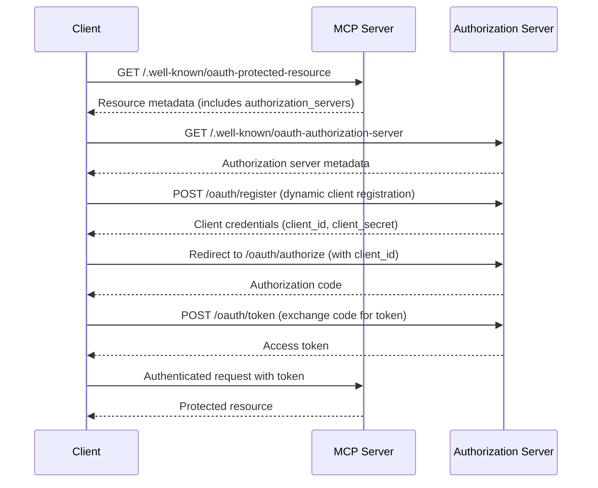

# Metadata Discovery

<EpicVideo url="https://www.epicai.pro/workshops/mcp-auth-ddk2h/intro-to-metadata-discovery-7idpi" />

Modern applications need a way for clients to discover how to authenticate and interact with servers securely. In the Model Context Protocol (MCP), this is achieved through standardized metadata endpoints that describe both the resource server (your MCP server) and its associated authorization server.

Without this discovery mechanism, clients would have to guess or hardcode authentication details, leading to brittle integrations and poor user experience.

## Why does this matter?

- **Seamless integration:** Clients (like VS Code, web apps, or other tools) can automatically discover how to authenticate and what endpoints to use.
- **Security:** By following standards, you reduce the risk of misconfiguration and security vulnerabilities.
- **Interoperability:** Any MCP-compliant client can connect to any MCP server, regardless of who built it.

## The relationship: Auth Server vs. Resource Server

- **Resource Server:** Your MCP server, which hosts protected resources and APIs.
- **Authorization Server:** Issues access tokens and handles user authentication. It may be a separate service or co-located with the resource server.

Clients first discover the resource server’s metadata, which points them to the authorization server’s metadata. This chain of discovery is what enables secure, standards-based authentication.

<callout-info>
	📜 See the [MCP Authorization
	Spec](https://modelcontextprotocol.io/specification/2025-06-18/basic/authorization)
	for details on discovery and metadata.
</callout-info>

## Example: Metadata Discovery Flow



### Realistic Example

```ts
// Discover resource server metadata
const resourceMeta = await fetch(
	'https://our-mcp-server.example.com/.well-known/oauth-protected-resource',
).then((r) => r.json())

// Find the authorization server URL
const authServerUrl = resourceMeta.authorization_servers[0]

// Discover authorization server metadata
const authMeta = await fetch(authServerUrl).then((r) => r.json())

// Now the client knows how to authenticate!
```

<callout-success>
	By implementing these endpoints, you make your MCP server discoverable and
	easy to integrate with any standards-compliant client.
</callout-success>

## Recommended Practices

- Always implement both resource and authorization server metadata endpoints.
- Use CORS headers to allow cross-origin discovery.
- Validate and document your endpoints for client developers.

<callout-muted>
	📜 For more, see [RFC 8414: OAuth 2.0 Authorization Server
	Metadata](https://datatracker.ietf.org/doc/html/rfc8414) and [RFC 9728: OAuth
	2.0 Protected Resource
	Metadata](https://datatracker.ietf.org/doc/html/rfc9728).
</callout-muted>
