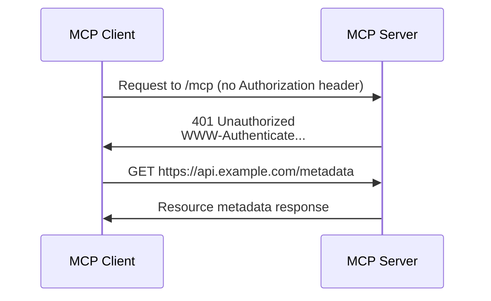

# Initialize OAuth Flow

<EpicVideo url="https://www.epicai.pro/workshops/mcp-auth-ddk2h/intro-to-authenticate-header-xosav" />

Modern web applications need a way to securely identify users and protect resources. The first step in this process is checking for an `Authorization` header on incoming requests. This is foundational for any OAuth flow.

In this exercise, you'll:

- Check for the presence of the `Authorization` header
- Respond with a `401 Unauthorized` and a `WWW-Authenticate` header if it's missing

<callout-info>
	The `Authorization` header is how clients prove their identity. If it's
	missing, your server must reject the request and tell the client how to
	authenticate.
</callout-info>

## Why does this matter?

Without this check, anyone could access protected endpoints on resource servers without credentials. By enforcing this, you ensure only authenticated clients can proceed.

## Example: Checking the Authorization Header

```ts
const authHeader = request.headers.get('authorization')
if (!authHeader) {
	return new Response('Unauthorized', {
		status: 401,
		headers: {
			'WWW-Authenticate': 'Bearer',
		},
	})
}
```

<callout-warning>
	Always include the `WWW-Authenticate` header in your 401 responses. This tells
	clients what kind of authentication is required.
</callout-warning>

## MCP Authentication Flow



## About the WWW-Authenticate Header

The `WWW-Authenticate` header tells the client what authentication scheme is required and can include additional parameters (called "auth params") that provide more details about how to authenticate.

The simplest value is just the scheme:

```
WWW-Authenticate: Bearer
```

But you can also include auth params, such as `realm`, `error`, `error_description`, or `resource_metadata`:

```
WWW-Authenticate: Bearer realm="example", error="invalid_token", error_description="The access token expired", resource_metadata="https://example.com/.well-known/oauth-protected-resource/mcp"
```

- **realm**: A string identifying the protected area (useful for clients to display to users)
- **error**: A short error code (like `invalid_token` or `insufficient_scope`)
- **error_description**: A human-readable explanation of the error
- **resource_metadata**: A URL pointing to metadata about the resource server (helps clients understand what they're accessing)

These parameters help clients understand why authentication failed and what to do next. You can include as many or as few as make sense for your use case.

For more details and a full list of possible parameters, see the [OAuth 2.0 RFC, section 5.2](https://datatracker.ietf.org/doc/html/rfc6749#section-5.2) and [MDN docs](https://developer.mozilla.org/en-US/docs/Web/HTTP/Headers/WWW-Authenticate).

## Recommended Practices

- Always check for the `Authorization` header on protected endpoints
- Use the `WWW-Authenticate` header in 401 responses
- Return clear, actionable error messages

## References

- 📜 [OAuth 2.0 RFC](https://datatracker.ietf.org/doc/html/rfc6749#section-3.1)
- 📜 [MDN: WWW-Authenticate](https://developer.mozilla.org/en-US/docs/Web/HTTP/Headers/WWW-Authenticate)
