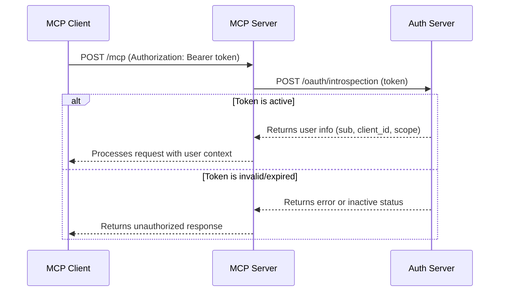

# Introspect

<EpicVideo url="https://www.epicai.pro/workshops/day-7-8-mcp-auth/introspect-pjgp6" />

👨‍💼 Ok, so we've got the user's auth token, but what do we do with it? Our server needs to know:

- Is the token valid?
- Is it still active?
- Who is this person? (user ID)
- What permissions do they have? (scopes)

So we need to "introspect" the token to get this information.

```ts
// When a user makes a request, we need to resolve their token
const authInfo = await resolveAuthInfo(request.headers.get('authorization'))
if (!authInfo) {
	return handleUnauthorized(request)
}

console.log(`User ${authInfo.extra.userId} from ${authInfo.clientId}`)
console.log(`Has scopes: ${authInfo.scopes.join(', ')}`)
```

Auth providers implement this slightly differently, but the core concept is the same: you send the token to the auth server, and it tells you everything you need to know about that token. Some auth providers store their token as a JWT which means the information is contained within the token itself and you don't need to perform a request to the auth server to get the information.

One way or another though, you need to determine whether the token is valid and active.

<callout-info>
	🔍 Token validation is essential for user-specific features. Without it, you
	can't personalize the experience or enforce proper permissions.
</callout-info>

The introspection process involves making a POST request to the auth server's introspection endpoint with the token. The response contains the user ID (`sub`), client ID (`client_id`), and scopes (`scope`) that tell you exactly what this token represents.

```ts
// Example introspection request
const validateUrl = new URL('/oauth/introspection', 'https://auth.example.com')
const resp = await fetch(validateUrl, {
	method: 'POST',
	headers: { 'Content-Type': 'application/x-www-form-urlencoded' },
	body: new URLSearchParams({ token }),
})

const result = await resp.json()
// result.sub = user ID
// result.client_id = app the user is using
// result.scope = space-separated list of permissions
```

<callout-info>
	🎯 When you're finished with this exercise, the behavior won't change
	visually. Consider adding a `console.log` to see the introspection results in
	action!
</callout-info>



<callout-muted>
	📜 For more details on token introspection, see the [OAuth 2.0 Token
	Introspection RFC](https://datatracker.ietf.org/doc/html/rfc7662).
</callout-muted>

The goal is to transform anonymous tokens into rich user context, enabling personalized experiences and proper permission enforcement.

Now, let's implement the `resolveAuthInfo` function to make this happen!
