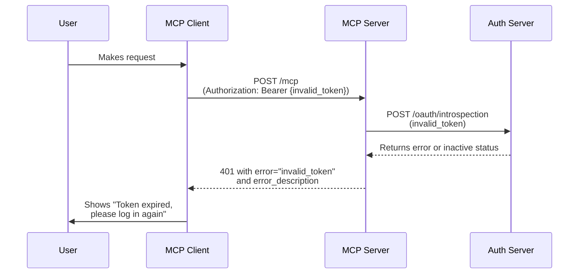

# Invalid Token Error

👨‍💼 When clients provide an authentication token that turns out to be invalid or expired, they need clear feedback about what went wrong. Without proper error messaging, users might think the service is broken or get confused about why their request failed.

The current error response doesn't distinguish between "no token provided" and "invalid token provided." This makes it harder for clients to provide helpful guidance to clients about what they need to do next.

```
// When no Authorization header is present:
WWW-Authenticate: Bearer realm="EpicMe", resource_metadata=https://example.com/.well-known/oauth-protected-resource/mcp

// When Authorization header is present but token is invalid:
WWW-Authenticate: Bearer realm="EpicMe", error="invalid_token", error_description="The access token is invalid or expired", resource_metadata=https://example.com/.well-known/oauth-protected-resource/mcp
```

By adding the `error` and `error_description` parameters to the `WWW-Authenticate` header when an Authorization header is present, clients can provide more specific guidance to users. This helps clients know what they need to do to fix the problem.

<callout-info>
	🎯 The `error` parameter follows OAuth 2.0 standards and helps clients
	distinguish between different types of authentication failures.
</callout-info>



<callout-warning>
	Only include error parameters when an Authorization header is present. Users
	without tokens should get a generic unauthorized response.
</callout-warning>

<callout-muted>
	📜 For more details on OAuth 2.0 error handling, see the [OAuth 2.0 Bearer
	Token Usage RFC](https://datatracker.ietf.org/doc/html/rfc6750#section-3.1).
</callout-muted>

The goal is to make authentication errors more actionable for users, helping them understand exactly what they need to do to fix the problem.

Now, let's enhance the error handling to provide better feedback when tokens are invalid!
