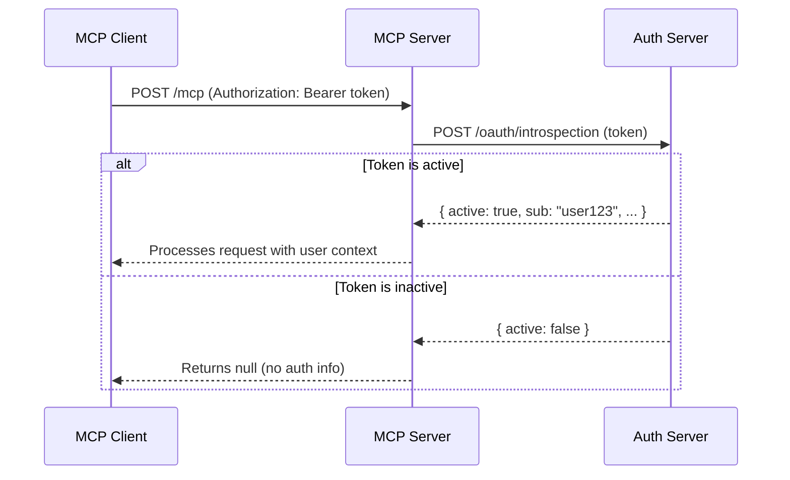

# Token Active

👨‍💼 When we introspect an auth token, the introspection endpoint will return whether the token is currently active (because tokens can be revoked or expired) and we need to check for that in our resolution callback.

The solution is to always verify that a token is active before trusting any of its claims. OAuth 2.0 introspection responses include an `active` property that tells us exactly this.

It's pretty simple:

```ts
const data = await introspectionResopnse.json()
if (!data.active) {
	// Token is expired, revoked, or invalid
	return null
}
```

## Discriminated Unions

🦉 As a bonus in this exercise step you can make the types nicer if you use discriminated unions. When working with responses that can have different shapes based on a property value, TypeScript's discriminated unions are incredibly useful. They let you create types that change based on a specific field, giving you type safety and better IntelliSense.

Here's a simple example of how discriminated unions work:

```ts
// A discriminated union based on the "status" property
type ApiResponse =
	| { status: 'success'; data: Array<string> }
	| { status: 'error'; message: string }

// TypeScript knows the shape based on the status
function handleResponse(response: ApiResponse) {
	if (response.status === 'success') {
		// TypeScript knows response.data exists here
		console.log(response.data.length)
	} else {
		// TypeScript knows response.message exists here
		console.log(response.message)
	}
}
```

Here's how you represent that with zod:

```ts
const introspectResponseSchema = z.discriminatedUnion('status', [
	z.object({
		status: z.literal('success'),
		data: z.array(z.string()),
	}),
	z.object({
		status: z.literal('error'),
		message: z.string(),
	}),
])
```

In our case, we'll use a discriminated union based on the `active` property to handle both active and inactive token responses safely.

<callout-warning>
	🎯 When a token is inactive, don't process any of its claims. Return null
	immediately to prevent unauthorized access.
</callout-warning>



<callout-muted>
	📜 For more details on OAuth 2.0 token introspection and the `active`
	property, see the [OAuth 2.0 Token Introspection
	RFC](https://datatracker.ietf.org/doc/html/rfc7662).
</callout-muted>

The goal is to ensure that only active, valid tokens can access our MCP server resources, maintaining security and providing a reliable user experience.

Now, let's implement proper token validation by checking the `active` property!

<callout-warning>
	🚨 Note: this is a difficult one to test because you need a token that's
	expired. As a result the tests will just make sure you didn't regress
	behavior, but they won't validate you got the `active` check right. Luckily
	it's pretty simple to know you got it right because it's really only one line
	of code you need.
</callout-warning>
