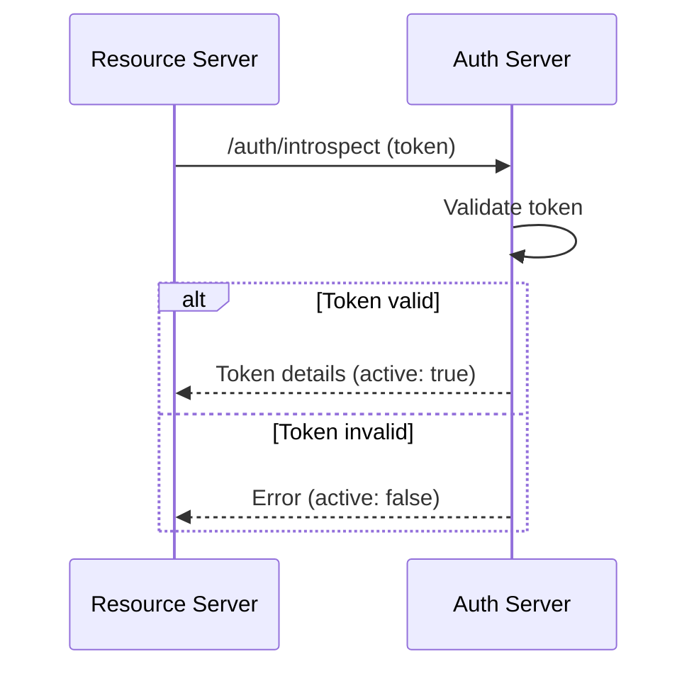

# Auth Info

<EpicVideo url="https://www.epicai.pro/workshops/day-7-8-mcp-auth/intro-to-auth-info~3k9ug" />

So the client sends your resource server a token. Sometimes this is enough, but often you need to be able to know who that token represents and the scopes associated to that token. This is often referred to as "introspection".

In this exercise, you'll learn how to introspect tokens, handle invalid tokens, and determine if a token is active—all essential for building robust, user-friendly authentication flows in MCP servers.

## What you'll learn

- How to introspect an access token and extract useful information
- How to handle invalid or expired tokens gracefully
- How to check if a token is active and what that means for your app

<callout-info>
	Token introspection is a standard way for APIs to validate and extract claims
	from access tokens. It helps you answer: Who is this user? What can they do?
	Is their session still valid?
</callout-info>

### Example: Introspecting a Token

```ts
const validateUrl = new URL('/oauth/introspection', 'https://auth.example.com')
const resp = await fetch(validateUrl, {
	method: 'POST',
	headers: { 'Content-Type': 'application/x-www-form-urlencoded' },
	body: new URLSearchParams({ token }),
})
const result = await resp.json()
if (!result.active) {
	throw new Error('Token is not active!')
}
console.log(result.sub) // user id
```

<callout-success>
	Always check the `active` property in the introspection response. If it's
	false, the token is invalid, expired, or revoked.
</callout-success>

### Error Handling

If a token is invalid, your server should return a clear error response. This helps clients know when to prompt users to log in again.

```txt filename="response.txt"
WWW-Authenticate: Bearer realm="EpicMe", error="invalid_token", error_description="The access token is invalid or expired.", resource_metadata=https://example.com/.well-known/oauth-protected-resource/mcp
```

<callout-warning>
	Never leak sensitive details about why a token is invalid. Stick to generic
	error messages for security.
</callout-warning>

### Sequence Diagram



## Recommended Practices

- Always validate tokens before trusting any claims.
- Handle invalid tokens gracefully
- Use introspection to power user-specific features and permissions.

- 📜 [OAuth 2.0 Token Introspection Spec](https://datatracker.ietf.org/doc/html/rfc7662)
- 📜 [MCP Auth Spec](https://modelcontextprotocol.io/specification/2025-06-18/basic/authorization)
