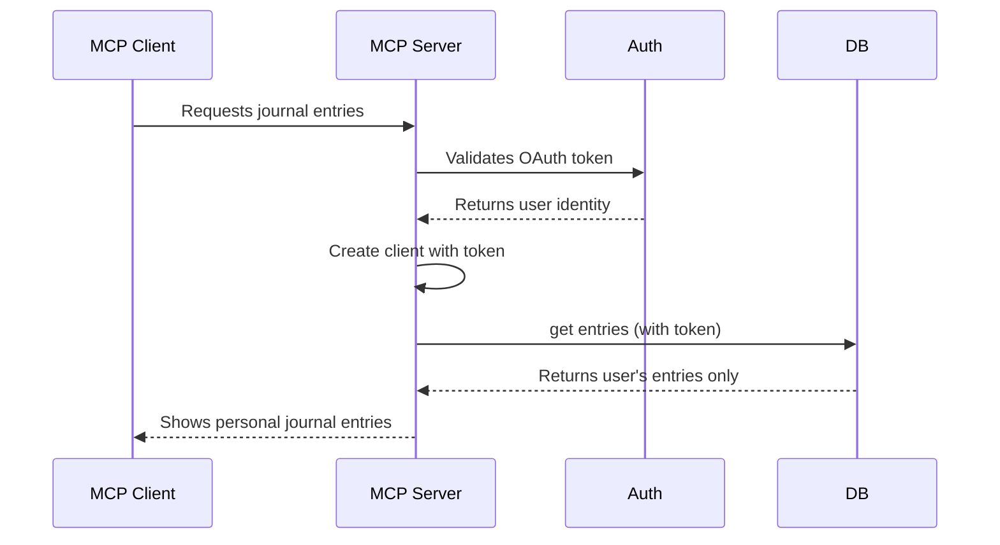

# Client Token

<EpicVideo url="https://www.epicai.pro/workshops/day-7-8-mcp-auth/client-token-st24u" />

👨‍💼 When we make requests using `this.db` (our db client), we need to include the user's authentication token so that the server knows who the user is and what they're allowed to access.

Right now the db client doesn't accept a token, so you need to update it to do so.

```ts
// Create a client that knows who the user is
const db = getClient(userOAuthToken)
const entries = await db.getEntries() // Only gets THIS user's entries
```

<callout-warning class="important">
	If there's no authentication token, we shouldn't even try to create a database
	connection. The user needs to be properly authenticated first!
</callout-warning>



<callout-muted>
	📜 For more details on OAuth tokens and authentication flows, see the [OAuth
	2.0 specification](https://tools.ietf.org/html/rfc6749).
</callout-muted>

The tricky part of this is how to get the auth info we get from the request into `EpicMeMCP` (our instance of the `McpAgent`). To do this with Cloudflare, we set the `ctx.props`:

```ts lines=1-3,5,15
type State = {}
type Props = { greeting: string }
export class MyMCP extends McpAgent<Env, State, Props> {
	async init() {
		console.log(this.props?.greeting)
	}
}

export default {
	fetch: async (request, env, ctx) => {
		// ...
		const url = new URL(request.url)
		const mcp = MyMCP.serve('/mcp')

		ctx.props.greeting = 'Hello, world!'
		return mcp.fetch(request, env, ctx)
	},
} satisfies EpicMeExportedHandler<Props>
```

Note, out of an abundance of caution, the types for `this.props` is `Props | undefined`. This means you need to check if it's undefined before using it. I recommend using the `invariant` function to throw an error if it's `undefined` because that should really never happen.
