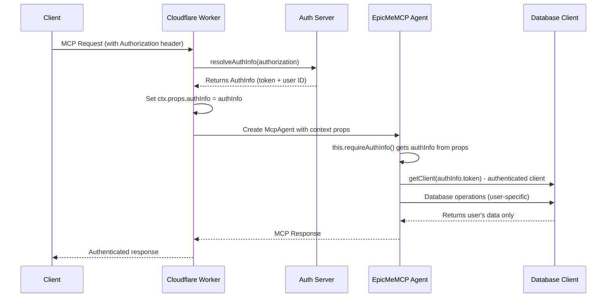

# Using the User

<EpicVideo url="https://www.epicai.pro/workshops/mcp-auth-ddk2h/intro-to-using-the-user-w1w8a" />

Now that we have the auth info, we need to get it into our MCP agent's context so we can make database calls with the user's token and also expose it to our tools and resources. With Cloudflare Workers, this is done through the `ctx.props` mechanism, which allows you to pass data from the request handler into your `McpAgent` instance.

Example:

```ts lines=2-3,8
// In your request handler
const authInfo = await resolveAuthInfo(request.headers.get('authorization'))
ctx.props.authInfo = authInfo

// In your McpAgent
export class EpicMeMCP extends McpAgent<Env, State, Props> {
	async init() {
		const authInfo = this.props?.authInfo
		// ...
	}
}
```

This approach ensures that every database operation is authenticated with the user's OAuth token, and every tool and resource can access the current user's information.

<callout-info>
	The `ctx.props` mechanism is Cloudflare Workers-specific. It allows you to
	pass data from the request handler into your `McpAgent` instance, making
	authentication information available throughout your MCP server.
</callout-info>

Here's how the authentication flow works:



The database client you'll be working with accepts an OAuth token as its second parameter, ensuring all database operations are scoped to the authenticated user:

```ts
// Create a client that knows who the user is
const db = getClient(EPIC_ME_AUTH_SERVER_URL, oauthToken)
const entries = await db.getEntries() // Only gets THIS user's entries
```

<callout-warning>
	If there's no authentication token, we shouldn't even try to create a database
	connection. The user needs to be properly authenticated first!
</callout-warning>

In this exercise, you'll learn how to:

- Pass authentication information through Cloudflare's `ctx.props` system
- Create user-specific database clients that automatically scope data access
- Build utility functions to access user information throughout your MCP server
- Expose user data through MCP tools and resources
- Ensure every operation is properly authenticated and user-scoped

You'll also explore how to structure your `McpAgent` class to handle authentication gracefully, using TypeScript generics to ensure type safety for your context props.

- 📜 [Cloudflare Workers Context](https://developers.cloudflare.com/workers/runtime-apis/context/)
- 📜 [OAuth 2.0 specification](https://tools.ietf.org/html/rfc6749)
