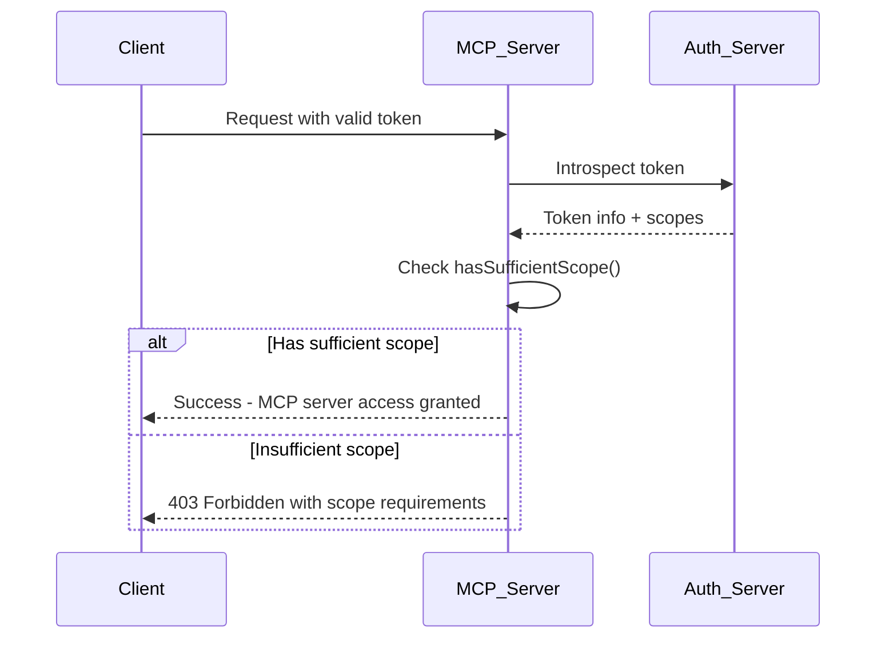

# Validate Sufficient Scope

👨‍💼 Some users are authenticating with no scopes which results in having a valid token, but not enough permissions to actually do anything useful with the MCP server. It would be better if we could let them know up front that they don't have enough permissions and need a new token with the appropriate scopes.

To do this, you return a `403 Forbidden` response with the appropriate `WWW-Authenticate` header:

```ts
// A music streaming app might check scopes like this
const requiredScopes = ['music:read', 'playlists:write']
const userScopes = ['music:read'] // User only has read access

const hasRequiredScopes = requiredScopes.every((scope) =>
	userScopes.includes(scope),
)

if (!hasRequiredScopes) {
	return new Response('Forbidden', {
		status: 403,
		headers: {
			'WWW-Authenticate': [
				`Bearer realm="MusicApp"`,
				`error="insufficient_scope"`,
				`scopes="${requiredScopes.join(' ')}"`,
			].join(', '),
		},
	})
}
```

The `WWW-Authenticate` header includes:

- The realm (`MusicApp`)
- The error type (`insufficient_scope`)
- The required scopes (`music:read playlists:write`)

However, the `scopes` auth param is tricky for us because there's actually a list of valid scope combinations that are allowed. The user could have one of several scopes that would be enough to use the MCP server. There's not an established pattern for handling this case, so we'll skip the `scopes` auth param and instead include a `error_description` that explains what scope combinations are valid.



<callout-muted>
	📜 For more details on OAuth scope validation and error handling, see the
	[OAuth 2.0 Authorization Framework
	RFC](https://tools.ietf.org/html/rfc6749#section-3.3) and [OAuth 2.0 Bearer
	Token Usage RFC](https://tools.ietf.org/html/rfc6750#section-3.1).
</callout-muted>

🧝‍♀️ I created a `minimalValidScopeCombinations` array and a `hasSufficientScope` function for you to use. It's just hard to describe what you should do, but simple once you see it. Feel free to <PrevDiffLink>check out my changes</PrevDiffLink> if you want.

Now, let's implement the scope validation logic to ensure only properly authorized clients can access the EpicMe MCP server!
