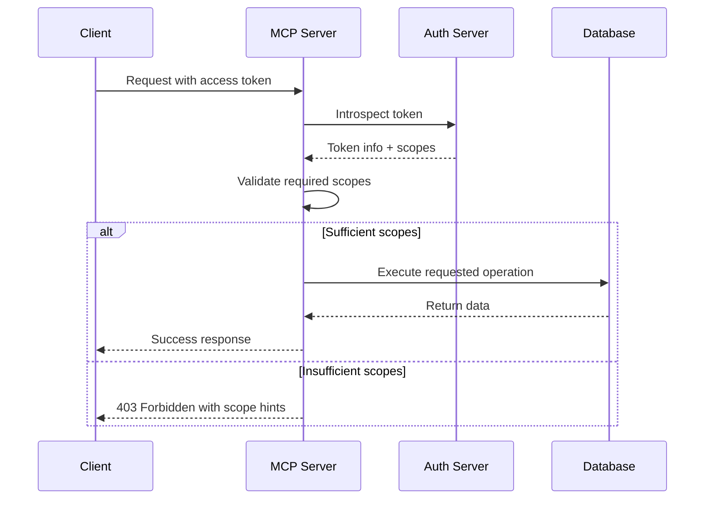

# Scopes

<EpicVideo url="https://www.epicai.pro/workshops/mcp-auth-ddk2h/intro-to-scopes-kpt4u" />

When building secure MCP servers, you need fine-grained control over what authenticated users can access. OAuth scopes provide this control by allowing you to define specific permissions that clients must request and users must grant. Without proper scope validation, your MCP server might expose sensitive data or allow unauthorized operations.

Think of scopes like keys to different rooms in a building. A user might have a key to the lobby (basic access) but not to the executive offices (admin functions). In our EpicMe journaling app, we want to ensure that clients can only access the data and perform the actions they're explicitly authorized for.

Here's a practical example of how scopes work in an MCP server:

```ts
// A photo sharing app might define scopes like this
const photoScopes = [
	'photos:read', // View photos
	'photos:write', // Upload photos
	'albums:read', // View albums
	'albums:write', // Create albums
	'profile:read', // View user profile
] as const

// Scopes help you control what users can access
async function getPrivatePhotos(userToken: string) {
	// Check if user has permission to read photos
	const hasPermission = checkUserScopes(userToken, ['photos:read'])
	if (!hasPermission) {
		return { error: 'Access denied' }
	}
	return await fetchPhotosFromDatabase()
}
```

<callout-info>
	OAuth scopes in MCP follow the same patterns as traditional OAuth 2.0. The MCP
	specification extends OAuth to work seamlessly with the Model Context
	Protocol, ensuring that your server can leverage existing OAuth infrastructure
	while providing the security guarantees your application needs.
</callout-info>

This exercise covers three essential aspects of scope management in MCP servers:

1. **Scope Validation**: Creating utilities to check if users have the required permissions
2. **Scope Enforcement**: Implementing proper error handling when scopes are insufficient
3. **Scope Discovery**: Helping clients understand what scopes are available

Here's a sequence diagram showing how scope validation works in an MCP server:



## Common Scope Patterns

Most applications follow similar patterns when defining scopes:

- **Resource-based scopes**: `photos:read`, `documents:write` - control access to specific resources
- **Action-based scopes**: `read`, `write`, `admin` - control what actions users can perform
- **Feature-based scopes**: `analytics:view`, `reports:generate` - control access to specific features
- **Hierarchical scopes**: `user:profile:read`, `user:profile:write` - create nested permission structures

<callout-success>
	The MCP specification allows servers to define their own scope names and
	meanings. This flexibility lets you design permission systems that match your
	application's specific security requirements.
</callout-success>

## Error Handling with Scopes

When a client lacks sufficient scopes, your server should return a clear error response that helps the client understand what permissions are needed:

```txt filename="403-response-header.txt"
WWW-Authenticate: Bearer realm="EpicMe", error="insufficient_scope", error_description="At least one of: photos:read photos:write albums:read is required."
```

This error response includes auth params for the `WWW-Authenticate` header:

- The realm or domain of interest (`EpicMe`)
- The specific error type (`insufficient_scope`)
- A human-readable description of what scopes are needed

There are more properties you can include, some of which we'll discuss later in this exercise.

## Scope Discovery

Clients need to know what scopes are available before requesting authorization. Your MCP server should expose this information through the OAuth protected resource metadata:

```json filename="/.well-known/oauth-protected-resource/mcp"
{
	"resource": "https://your-server.example.com/mcp",
	"authorization_servers": ["https://auth-server.example.com"],
	"scopes_supported": [
		"photos:read",
		"photos:write",
		"albums:read",
		"albums:write",
		"profile:read"
	]
}
```

In this exercise, you'll learn how to:

- Create scope validation utilities that check user permissions
- Implement proper error handling for insufficient scopes
- Add scope hints to help clients understand what permissions are available
- Expose scope information through OAuth metadata endpoints

You'll also explore how to structure your scope validation logic for maintainability and how to provide clear error messages that help both developers and end users understand permission requirements.

- 📜 [OAuth 2.0 Scopes RFC](https://tools.ietf.org/html/rfc6749#section-3.3)
- 📜 [MCP Authentication Specification](https://modelcontextprotocol.io/specification/2025-06-18/basic/authorization)
