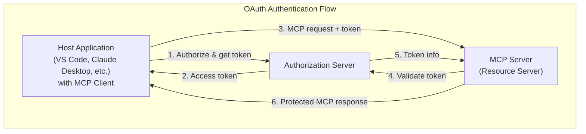

# MCP Auth 🔐

<EpicVideo url="https://www.epicai.pro/workshops/day-7-8-mcp-auth/intro-to-mcp-auth~u45z1" />

👨‍💼 Hello, my name is Peter the Product Manager. I'm here to help you get
oriented and to give you your assignments for the workshop!

Welcome to **MCP Auth**! In this workshop, you'll master authentication and authorization for
[Model Context Protocol (MCP)](https://modelcontextprotocol.io/specification/2025-06-18) servers—the essential skills for building secure, production-ready MCP applications that handle real user data.

The Model Context Protocol is powerful, but without proper authentication, your MCP servers can only provide public data. To build truly useful applications—journaling apps, document managers, personal assistants—you need to securely identify users and control access to their private resources.

We're focused on the Resource Server in this workshop. That's the MCP server
that you're building and will be the most valuable information for you as a
developer of MCP servers.

Throughout this workshop, you'll learn:

- **Service Discovery**: Implement OAuth metadata endpoints that let clients automatically discover how to authenticate with your MCP server
- **Authorization Headers**: Properly handle OAuth Bearer tokens and provide clear authentication challenges when tokens are missing or invalid
- **Token Introspection**: Validate access tokens and extract user information using industry-standard OAuth 2.0 introspection
- **User Context**: Pass authenticated user information through your MCP server to ensure all operations are properly scoped to the current user
- **Scope-based Permissions**: Implement fine-grained access control using OAuth scopes to protect sensitive operations and data

We'll be building a secure version of **EpicMe**, a personal journaling application that demonstrates real-world authentication patterns. You'll see how to:

- Protect journal entries so users only see their own content
- Implement scope-based permissions for read vs. write operations
- Handle authentication errors gracefully with helpful error messages
- Provide metadata endpoints that make your server easy to integrate with

This workshop uses the
[OAuth 2.0 standard](https://tools.ietf.org/html/rfc6749) and follows the
[MCP Authentication specification](https://modelcontextprotocol.io/specification/2025-06-18/basic/authorization),
ensuring your skills transfer to any OAuth-compatible system.

We'll be using:

- [MCP TypeScript SDK](https://github.com/modelcontextprotocol/typescript-sdk) for our MCP server implementation
- [Cloudflare Workers](https://workers.cloudflare.com/) as our runtime environment
- Standard OAuth 2.0 flows for authentication and authorization

<callout-info>
	**Prerequisites**: This workshop builds on MCP fundamentals. If you're new to
	MCP, consider taking [Advanced MCP
	Features](https://www.epicai.pro/advanced-mcp-features) first to get familiar
	with the protocol basics.
</callout-info>

Ready to build secure, user-aware MCP applications? Let's dive into the world of authenticated Model Context Protocol servers!
